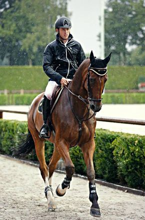

# Caption this image!
This is a project to generate captions (a short description describing what is probably happening in an image) for any image.
For example it can generate captions as follows:

#### A Man on a horse walking down the road

## How does it do it?

### Training
The crux of the model is a dynamic Recurrent Neural Network trained to generate sequence of words/tokens based on a sequence of input tokens(original captions from the train set). As the entire sequence of true caption tokens are known in advance, the dynamic RNN helps in unraveling all the hidden states at once.

The network is conditioned on embedded image vectors, which is used as the initial hidden state of the recurrent layer. To generate the embedded image vectors, we use the penultimate layer of a pretrained Inception V3 model.

With the CNN + RNN network so structured, we train only the recurrent layer; categorical cross-entropy is used as the optimizer to generate a sequence of tokens as close to the original caption as possible.

### Caption generation
With the RNN so trained, we build another simple RNN configured with the weights of the dynamic RNN above and use it to generate one token at a time. Same as before, the RNN is conditioned on the embedded image vector produced by inception V3 and takes a designated <Start> token as the input in time 0. At time t, it produces a probability distribution over the entire vocabulary. The next token of the caption is sampled from this distribution and at the same time fed as the input to the network at time t+1
